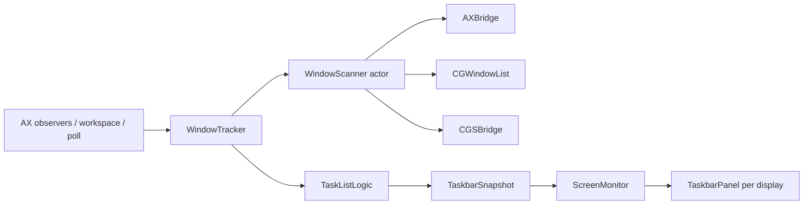
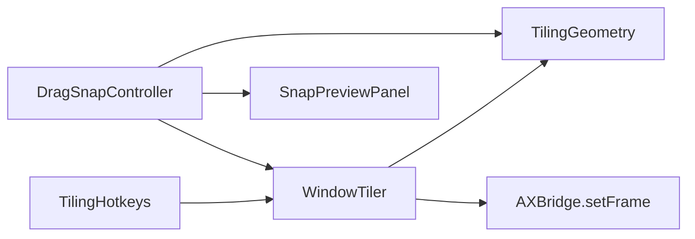

# Architecture

Omnibar is a single macOS app target (`io.specktronica.omnibar`) plus a host-app unit-test bundle. UI is AppKit except Settings and onboarding, which are SwiftUI hosted in `NSWindow`s. The process is an accessory app (`LSUIElement` / `NSApplication.ActivationPolicy.accessory`) so it does not appear in the Dock while running.

## Layout

```
Omnibar/
  App/          entry, AppDelegate, menu extra, login item
  Bridge/       Accessibility, SkyLight/CGS, Dock badge AX
  Core/         scan, track, screens, Dock, catalog, thumbnails, actions, tiling
  Model/        settings, pins, blacklist, order, snapshots, geometry
  UI/           taskbar, Start Menu, settings, onboarding, snap preview
  Resources/    assets, entitlements
OmnibarTests/   logic and geometry tests (no live window-server tests)
project.yml     XcodeGen spec
scripts/        bootstrap (XcodeGen), build, package/notarize, Homebrew publish, uninstall, secret scan
```

## Startup

`OmnibarMain` installs `AppDelegate` and runs `NSApplication`. On launch:

1. Load `SettingsStore` from `UserDefaults` and sync the login item.
2. Create the menu extra (`StatusItemController`).
3. Start `AppCatalog` (application directories + recents).
4. Apply Dock hiding from settings (`DockManager`).
5. If Accessibility is trusted, start `WindowTracker`, `ScreenMonitor`, `TilingHotkeys`, and `DragSnapController`. Otherwise show onboarding. The taskbar does not start while onboarding is showing; Continue (or closing the window) posts `.omnibarPermissionsDidChange` after `isShowing` is cleared. Screen Recording is effective for capture only when `CGPreflightScreenCaptureAccess()` was already true at process start. A mid-session grant is pending restart: preflight stays false until relaunch, so onboarding detects the TCC toggle via other processes’ normal-level window titles (`kCGWindowName`). Windows not at the normal window level (menu bar, wallpaper, Dock, Control Center) are ignored because those titles appear without Screen Recording.

On quit, Dock prefs are restored, then hotkeys, drag snap, tracker, screen monitor, and catalog stop.

## Window list pipeline



`WindowTracker` coalesces scans. Triggers include:

- AX notifications on regular apps (window create/destroy, title, miniaturize, focus, move, resize, hide/show)
- `NSWorkspace` launch/terminate/activate/hide/unhide and Space change
- screen parameter changes, settings/pins/blacklist/badge notifications
- a repeating poll (`pollInterval`, minimum 0.5 s)

`WindowScanner` (an actor) builds `WindowInfo` from Accessibility windows crossed with `CGWindowListCopyWindowInfo`. It keeps layer-0 windows of regular apps, skips a hard-coded system set and the blacklist, drops untitled floating windows (`AXFloatingWindow` / `AXSystemFloatingWindow` with an empty title), and drops frames smaller than 40×40 points.

Space membership and “this display is a fullscreen Space” come from private SkyLight symbols loaded in `CGSBridge` (`CGSCopyManagedDisplaySpaces` / `SLS…` and related). `TaskListLogic` then:

- filters to the current Space (unless “show windows from all screens”); minimized windows remain on their last screen
- optionally collapses same-title tabs
- groups by application or emits one tile per window
- inserts pinned launchers for bundle IDs with no open windows
- applies `OrderStore` for in-session order

`ScreenMonitor` owns one `TaskbarPanel` per display, hides panels for displays in `hiddenDisplayIDs` or in a fullscreen Space, and drives auto-hide from mouse location.

## Actions and overlays

`WindowActions` raises, minimizes, unminimizes, closes, fullscreens, hides, quits, and “New Window” through `AXBridge` and `NSRunningApplication`. Primary click and middle-click are handled there. The thin Show desktop slice on the right of each bar calls `ShowDesktopController`, which minimizes every visible window on the current Spaces and restores that set on the next click.

Each `TaskbarPanel` owns a `StartMenuPanel` and `ThumbnailPopover`. Thumbnails use ScreenCaptureKit (`ThumbnailService`) only when Screen Recording was already granted at process start (`PermissionsManager.screenRecordingTrusted`).

`OverlapResizer` optionally shrinks windows whose Cocoa frames intersect the bar, skipping fullscreen/minimized/hidden windows, a bundle skip list, and PIDs that failed verification twice.

`DockBadgeReader` reads badge strings from Dock via Accessibility on a 2 s timer.

## Window tiling



`TilingGeometry` (Model) is pure and `nonisolated`: `Tile` frames inside a usable rect, the left/right cycle (`nextTile`), the usable area (`visibleFrame` with its bottom raised above the Taskbar when `ScreenMonitor.showsTaskbar(on:)`), drag snap zones, shared display edges, and the Cocoa→CG inverse of `ScreenGeometry.cocoaRect`.

`WindowTiler` resolves the frontmost app's focused window, requires `AXWindow` / `AXStandardWindow`, not fullscreen or minimized, and settable position and size (`AXUIElementIsAttributeSettable`). It converts between Cocoa and CG coordinates, calls `AXBridge.setFrame` (position, size, re-read, re-apply position if the app shifted the origin while clamping), and keeps `[CGWindowID: AppliedTile]` so a clamped window can still advance through the cycle. The memory is pruned to the current snapshot's window IDs on `.omnibarSnapshotDidChange`.

`TilingHotkeys` registers Left/Right Arrow with the configured modifiers through Carbon `RegisterEventHotKey` on the application event target. The C handler is `nonisolated` and hops to the main actor. No `CGEventTap` is used, so no Input Monitoring grant is needed. `eventHotKeyExistsErr` (another app owns the combination) is logged and left unregistered. Registration follows `tilingShortcutsEnabled` and `tilingModifiers` through `.omnibarSettingsDidChange`.

`DragSnapController` installs global `NSEvent` monitors for left mouse down, dragged, and up (same mechanism as `ScreenMonitor` auto-hide). On mouse-down it records the layer-0 window under the cursor from `CGWindowListCopyWindowInfo` (id, pid, bounds); this has to happen before the window starts following the cursor, or the hit test finds the window behind it. A press over a bar, Start Menu, or thumbnail is ignored. After 4 pt of movement it maps the hit to an AX element (tracker cache first) and rejects non-tileable windows. Every 40 ms it reads the AX frame; a drag counts as a move once the origin has changed by 3 pt from the mouse-down bounds with the size unchanged, which excludes resizes. Snap zones are computed for the screen under the cursor with that screen's shared edges removed; `SnapPreviewPanel` (borderless, non-activating, floating, mouse-transparent) shows the target frame. On mouse-up the tile is applied after 50 ms so the dragged app finishes its own move first. Monitors follow `dragToTileEnabled`.

macOS 15+ edge tiling (`com.apple.WindowManager` `EnableTilingByEdgeDrag`, default on) acts on the same gesture: it animates the window to its own tile for about 0.35 s after mouse-up and ignores Accessibility frame changes until roughly 0.6 s. `DragSnapController` therefore re-checks the frame at +0.7 s, +1.2 s, and +1.7 s after the first apply and re-applies the tile when the window is neither on the target nor on the frame the app last accepted. The Tiling settings pane reads the same key and shows a note with a link to Desktop & Dock when it is on.

## Persistence

All of these are keys in `UserDefaults.standard`:

| Key | Contents |
| --- | --- |
| `omnibar.settings.v1` | JSON `AppSettings` |
| `omnibar.pins.v1` | pinned bundle IDs, order preserved |
| `omnibar.blacklist.v1` | blacklisted bundle IDs |
| `omnibar.recents.v1` | recent-launch bundle IDs |
| `omnibar.dock.backup.v1` | Dock autohide, delay, time-modifier, and orientation backup while fully hidden |

`OrderStore` is memory-only. `SettingsStore.resetToDefaults()` keeps the current launch-at-login value, writes default settings, reverts Dock, and clears order.

## Private and privileged APIs

| Area | Mechanism |
| --- | --- |
| Window titles, raise/minimize/close/fullscreen, move/resize for tiling | Accessibility (`AXUIElement`) |
| Window frames, on-screen set, layers, window under the cursor | `CGWindowListCopyWindowInfo` |
| Tiling hotkeys | Carbon `RegisterEventHotKey` |
| Drag detection for drag-to-tile | Global `NSEvent` mouse monitors |
| Spaces and fullscreen Spaces | SkyLight (`dlopen` of `CGS*` / `SLS*` symbols) |
| Mission Control Dock strip | `CGSSetWindowLevel` on Dock windows |
| Live thumbnails | ScreenCaptureKit |
| Launch at login | `SMAppService.mainApp` |

The app is not sandboxed (`ENABLE_APP_SANDBOX` is NO; entitlements file is empty). Hardened Runtime is on.

## Tests

`OmnibarTests` covers stores, list logic, geometry, tiling geometry, paging, settings decode, onboarding/TCC helpers, thumbnails, show-desktop, overlap, and related pure helpers. Tests load the app as `TEST_HOST`. `AppDelegate` returns immediately when `XCTestCase` is present so the live tracker does not start inside the test host.
